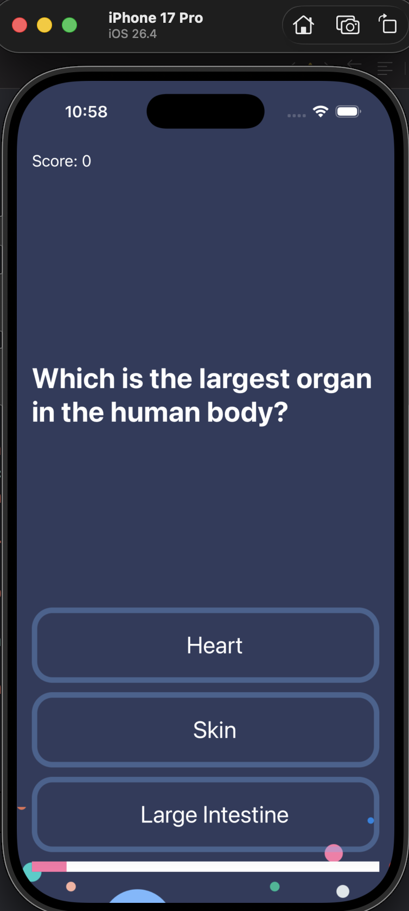
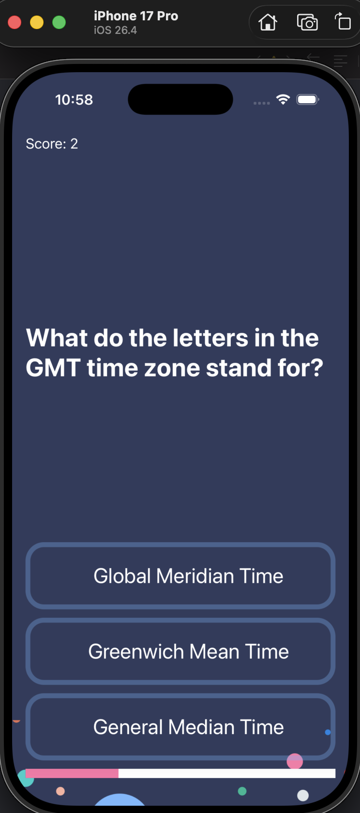

# 📱 Quizzler - iOS Trivia App (MVC Architecture)

Quizzler, genel kültür sorularından oluşan, dinamik kullanıcı arayüzü elementlerine ve akıllı zaman yönetimine sahip çoktan seçmeli bir iOS bilgi yarışması uygulamasıdır.

---

## 🛠️ Öne Çıkan Teknik Detaylar & Mühendislik Yaklaşımları

* **Mimarî Yapı (MVC):** Apple standartlarına uygun **Model-View-Controller** yapısı kullanılarak kod karmaşası önlendi. Projenin mantıksal hesaplamaları (`QuizBrain`), arayüz katmanından (`ViewController`) tamamen soyutlandı.
* **Immutability & Veri Güvenliği:** Soru modelleri `Struct` yapıları ile kuruldu. Veri güvenliğini korumak adına değişmezlik (`let`) felsefesi uygulandı ve veri güncellemeleri için Swift'in `mutating` fonksiyon yapısı kullanıldı.
* **Asenkron UI Yönetimi:** Kullanıcının verdiği cevapların ardından buton renklerinin (Yeşil/Kırmızı) sıfırlanması ve yeni soruya geçiş süreci `Timer.scheduledTimer` ile asenkron olarak (0.2 saniye gecikmeyle) yönetildi.
* **Dinamik Progress Bar:** Kullanıcının ilerleme durumu, dizinin indis mantığı ile insan sayma mantığı arasındaki farkı kapatmak adına `+1` offset formülüyle `UIProgressView` üzerinde dinamik olarak hesaplandı.

---

## 📸 Uygulama İçi Ekran Görüntüleri

| Soru Ekranı | Cevap Tepki Ekranı |
|---|---|
|  |  |

---

## 🛠️ Kullanılan Teknolojiler & Araçlar
* **Dil:** Swift 5
* **Framework:** UIKit (Storyboard, UIButton, UILabel, UIProgressView)
* **Konseptler:** OOP, Value Types vs Reference Types, Optional Handling
* **Araçlar:** Xcode, Git & GitHub
